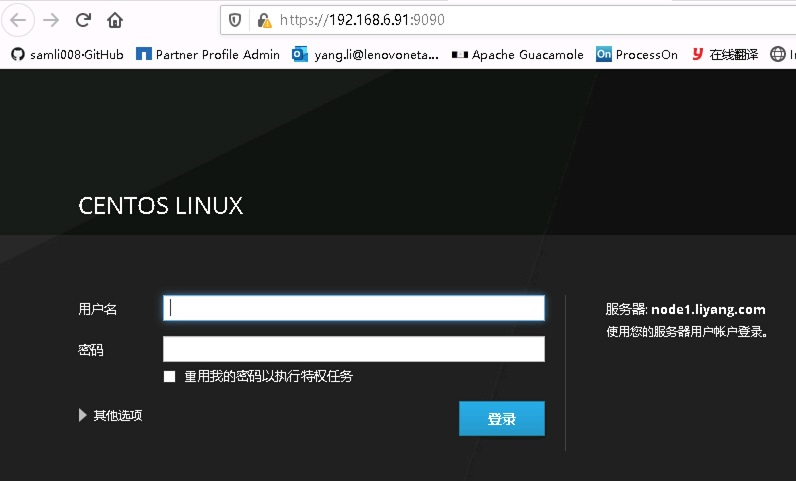

## install cockpit access ip:9090 with web
```
yum -y install cockpit
systemctl enable cockpit.socket
systemctl start cockpit.socket
```
## install dashboard
```
yum -y install cockpit-dashboard
```
## install storaged-plugin
```
yum -y install cockpit-storaged
```
## install kvm-plugin
```
yum -y install cockpit-machines
```
## install docker-plugin
```
yum -y install cockpit-docker
```
# install k8s-plugin
```
yum -y install cockpit-kubernetes
```

